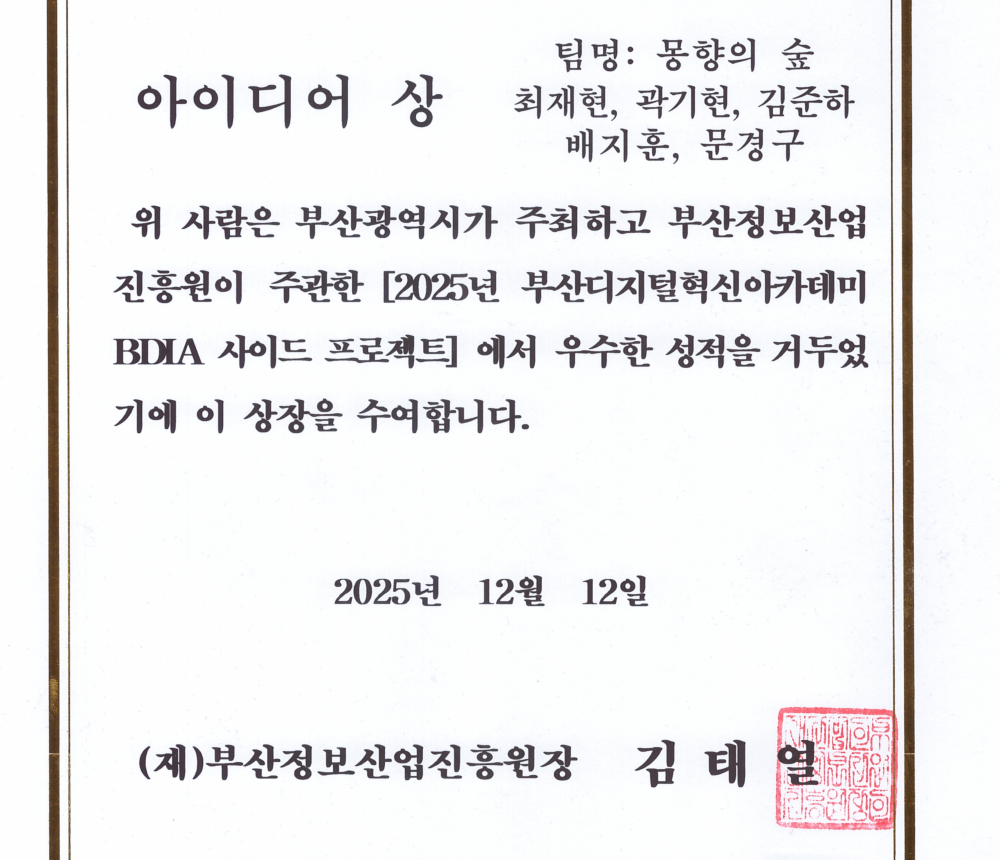
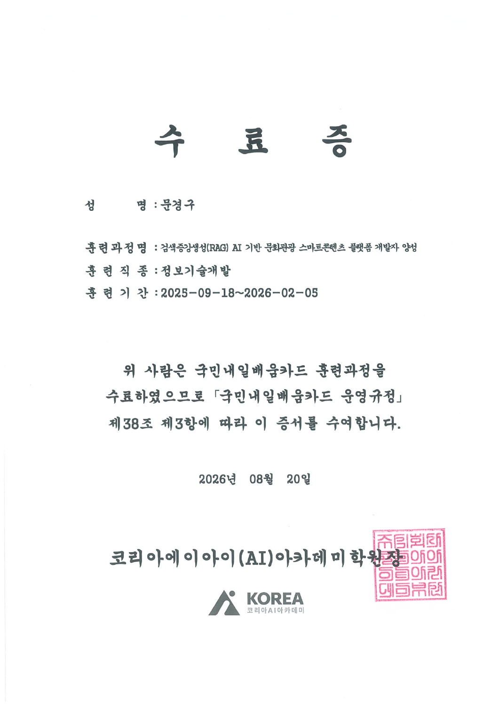
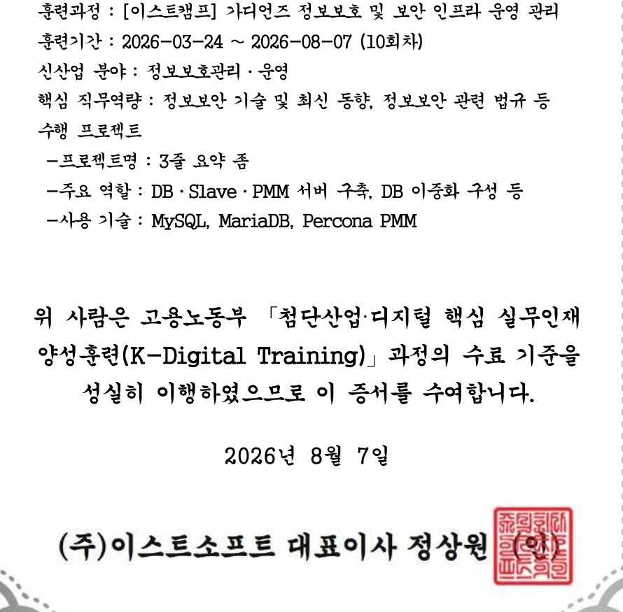

<!-- 헤더 배너 (kikobeats/capsule-render) -->

  

  <h3>✨ 기록과 회고를 통해 꾸준히 성장하는 개발자, 문경구입니다.</h3>
  

    웹 서비스의 사용자 경험과 백엔드 데이터 흐름을 함께 고민합니다. 
    정보보호·보안 인프라 운영과 RAG 기반 AI 서비스까지 학습하고 프로젝트로 기록하고 있습니다.
  

  <!-- GitHub / Contact 뱃지 -->
  
  

 

---

### 👋 About Me

- **관심 분야:** 풀스택 웹 개발, 보안 인프라, RAG 기반 AI 서비스
- **일하는 방식:** 목표를 세우고 구현 과정을 기록하며, 결과를 회고해 다음 개선으로 연결합니다.
- **프로젝트 기록:** [GrayGuard](https://github.com/gyeonggumun/GrayGuard) · [SafeStay](https://github.com/gyeonggumun/SafeStay) · [CleanTicket](https://github.com/gyeonggumun/CleanTicket)

### 🏆 Awards

**2025 부산디지털혁신아카데미(BDIA) 사이드 프로젝트 아이디어 상** · 2025.12.12 
팀 *몽향의 숲* 수상 · 부산광역시 주최, 부산정보산업진흥원 주관

BDIA 사이드 프로젝트 아이디어 상 상장 보기

 

**두 번째 수상 경력:** 자료 확인 후 추가 예정

<!-- 두 번째 상장: 수상명 / 수상일 / 주최·주관 / 이미지 경로를 확인한 뒤 추가 -->

### 🎓 Education

| 기간 | 교육 과정 | 상태 |
| --- | --- | --- |
| 2025.09.18 ~ 2026.02.05 | 검색증강생성(RAG) AI 기반 문화관광 스마트 콘텐츠 플랫폼 개발자 양성 | 수료 |
| 2026.03.24 ~ 2026.08.07 | [이스트캠프] 가디언즈 정보보호 및 보안 인프라 운영 관리 | 수료 |
| ~ 2026.11.12 예정 | SKT 알래프 교육 | 진행 중 · 수료증 추가 예정 |

RAG 기반 문화관광 콘텐츠 개발자 과정 수료증 보기

 

가디언즈 정보보호 및 보안 인프라 운영 관리 과정 수료증 보기

 

<!-- SKT 알래프 교육 종료 후 수료증 이미지와 실제 수료일 추가 -->

---

### 🛠️ Tech Stacks

#### 🌐 Frontend

  
  
  
  
  
  
  

#### ⚙️ Backend & Database

  
  
  
  
  
  

#### 🚀 Tools & Deployment

  
  
  
  

 

---

### 🚀 Featured Projects

#### 👥 대표 팀 프로젝트

> 선정 후 프로젝트명·담당 역할·핵심 성과·저장소 링크를 추가할 예정입니다.

<!-- 팀 프로젝트: 프로젝트명 / 문제와 목표 / 본인 역할 / 기술 / 결과 / 저장소 링크 / 이미지 -->

#### 👤 대표 개인 프로젝트

> 선정 후 프로젝트명·구현 내용·핵심 성과·저장소 링크를 추가할 예정입니다.

<!-- 개인 프로젝트: 프로젝트명 / 문제와 목표 / 구현 내용 / 기술 / 결과 / 저장소 링크 / 이미지 -->

 

---

### 📊 GitHub Activity & Stats

  <table border="0">
    <tr>
      <td>
        
      </td>
      <td>
        
      </td>
    </tr>
  </table>

  

 

---

  Designed with ❤️ by <a href="https://github.com/gyeonggumun">gyeonggumun</a>

